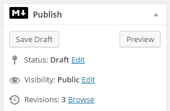

# CommonMark Plugin for WordPress

WP CommonMark is a plugin for [WordPress](https://wordpress.org/) that enables [CommonMark](http://commonmark.org/): a strongly specified, highly compatible implementation of [Markdown](https://daringfireball.net/projects/markdown/syntax), inside of your WordPress installation.

You can write contents in Markdown using CommonMark [latest spec](http://spec.commonmark.org/) on a per-post basis. The markdown version of your post is stored separately, so you can deactivate this plugin at any moment without breaking things. You can keep some posts in HTML and write others in markdown or switch between both HTML and markdown revisions on the same post.

## How to use

You can manage the type of syntax used in your contents, simply by activating or de-activating the switch placed on the "Publish" metabox.



## Requirements

* PHP >= 5.4.0
* Wordpress >= 4.3.0

## Installation

You can install this plugin via command-line or the WordPress admin panel.

### via Command-line

Add WP CommonMark to project's dependencies using [Composer](https://getcomposer.org/).

```sh
composer require starise/wp-commonmark
```

Then activate the plugin via [wp-cli](http://wp-cli.org/commands/plugin/activate/).

```sh
wp plugin activate wp-commonmark
```

### via WordPress Admin Panel

1. Download the [latest release](https://github.com/starise/wp-commonmark/releases) of this repo.
2. In your WordPress admin panel, navigate to Plugins->Add New
3. Click Upload Plugin
4. Upload the zip file that you downloaded.

## Credits

Copyright © 2015 [Andrea Brandi](http://andreabrandi.com)

Inspired by [Markdown on Save](https://wordpress.org/plugins/markdown-on-save/) by Mark Jaquith and Markdown module in [Jetpack](https://wordpress.org/plugins/jetpack/) by Automattic.

Uses [league/commonmark](https://github.com/thephpleague/commonmark) as default markdown parser
